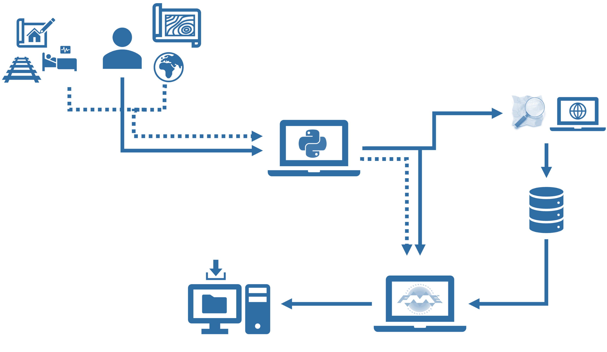

# Humanitarian GeoData Repository (HGDR)
## Contexte
Depuis plusieurs année, [INSER](https://www.inser.ch/fr) collabore avec des administrations et des organisations actives dans le domaine humanitaire ou la gestion des crises, notamment le [CICR](https://www.icrc.org/fr), [MSF](https://www.msf.ch/) et le [CSA](https://www.eda.admin.ch/deza/fr/home/ddc/organisation/domaines/aide-humanitaire.html) (Corps suisse d'aide humanitaire).
 
Pour toutes ces organisations, les géodonnées font partie des bases d'une mission. Elles doivent être disponibles rapidement lors de la préparation de la mission, et en appui des personnels envoyés sur le terrain.
 
## Diagnostic
Actuellement, de nombreuses sources de géodonnées sont disponibles pour les humanitaires, notamment sur les plateformes suivantes:

 - [Hdx](https://data.humdata.org/)
 - [OSM](https://www.openstreetmap.org/)(au travers de [Geofabrik](https://download.geofabrik.de) ou [OSMaxx](https://osmaxx.hsr.ch/) par exemple)
 - ESRI humanitarian data [hub](https://explore-humanitarian.hub.arcgis.com/)
 - [Mapaction](https://mapaction.org/)

 
En cas de déploiement en urgence, on constate souvent que l'accès à ces sources de données n'est pas aussi simple qu'il devrait être. Les liens ne sont plus valables, les tokens sont à rafraîchir, les serveurs ne sont plus fonctionnels par arrêt de leur financement c'est actuellement le cas de [OSMaxx](https://osmaxx.hsr.ch/), etc…
Au final, la récupération de données de base consomme beaucoup de temps alors qu'elle devrait être simple.
 
 
## Objectif du projet
 
Le projet du HGDR (Humanitarian GeoData Repository) consiste à s'assurer de disposer régulièrement des données nécessaires en cas d'intervention. Il consiste à anticiper les difficultés en récupérant les données de manière régulière et automatisée, lorsque la pression du temps n'est pas un facteur critique. Ceci offre la garantie de disposer, en temps voulu, d'un jeu de données prêt et validé.
 
## Composantes du projet
Pour fonctionner, le système doit s'appuyer sur des composantes automatisées et hébergées sur le cloud.
L'[ETL](https://fr.wikipedia.org/wiki/Extract-transform-load) ([FME Cloud](https://www.safe.com/fme/fme-cloud/)) joue un rôle central car:

 - Il visite régulièrement les sources de données surveillées et télécharge les données
 - Il est aussi utilisé pour appliquer les outils de transformation des données (voir plus bas)
 - Il assure un monitoring des sources de données et avertit les gestionnaires en cas de problème avec un des fournisseurs de données
 - Il permet aux utilisateurs "clients" de commander des données sur la région souhaitée, et dans le format de données souhaité

 
Le stockage de données est bien évidemment important, car il permet de stocker les données téléchargées. Le niveau d'agrégation des données doit rester faible pour garantir une grande flexibilité du système pour les utilisateurs. Afin de garantir une "neutralité" de gestion des données, il nous semble important que les données soient stockées en Suisse, auprès d'un fournisseur de services de droit suisse. La pertinence de cet argument pourra être discuté avec les partenaires du projet, considérant qu'il s'agit de données de base et pas de données opérationnelles, nettement plus sensibles.
 
Des outils sont mis à disposition, par exemple:

 - Un outil de translittération est appliqué à chacun des jeux de données. Ceci permet de disposer de données lisibles pour un utilisateur occidental, même si la source de données utilise d'autres jeux de caractères
 - Des outils de reprojection. Les données des différentes sources doivent être compatibles entre elles au niveau de la référence spatiale.
    L'outil d'extraction des données doit permettre de commander les données selon un "BoundingBox" simple, et pas uniquement selon des unités administratives.
 -  A moyen terme, on peut imaginer que des outils de création de données (par exemple l'extraction de données à partir d'images satellitaires au moyen de IA) pourraient aussi être mis en place. Il y a ici un grand potentiel de projets de recherche à venir. 

 
## Partenaires du projet
Le projet est essentiellement soutenu dans son démarrage par le [CSA](https://www.eda.admin.ch/deza/fr/home/ddc/organisation/domaines/aide-humanitaire.html).
Une 1ère prise de température a montré un intérêt potentiel auprès du [CICR](https://www.icrc.org/fr) (Yann Rebois).
Un tel contact doit encore être pris avec [MSF](https://www.msf.ch/) (Ken Bragg).
Une discussion a eu lieu avec [ESRI](https://www.esri.ch/fr-ch/home) (Oliver Cottray, Humanitarian) qui suit le projet d'un bon œil.
 
Des contacts relatifs à une collaboration opérationnelle vont avoir lieu avec [Mapaction](https://mapaction.org/) et [CartONG](https://cartong.org/fr).
 
[INSER](https://www.inser.ch/fr) assume le lead du projet. Il met à disposition du projet son infrastructure [FME Cloud](https://www.safe.com/fme/fme-cloud/), au moins pour la phase de développement.

